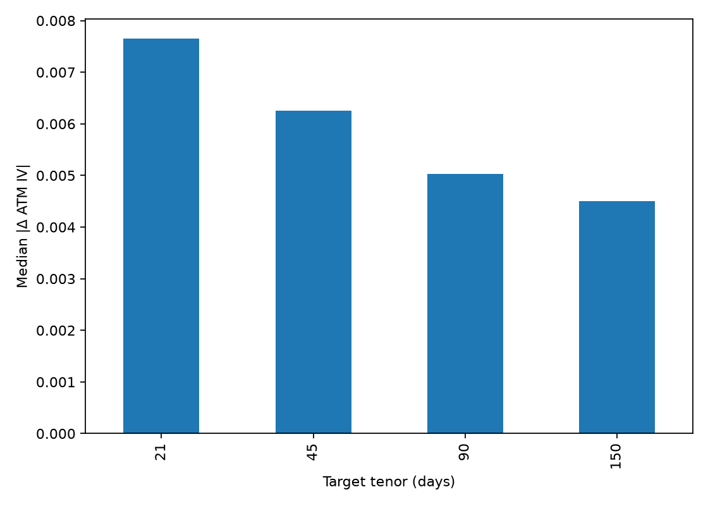
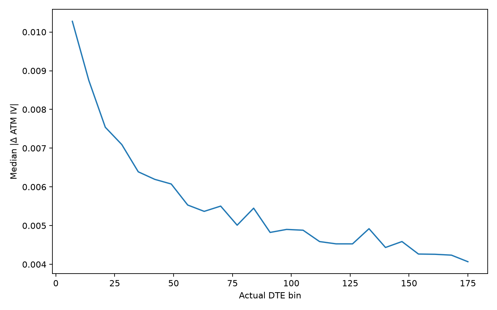
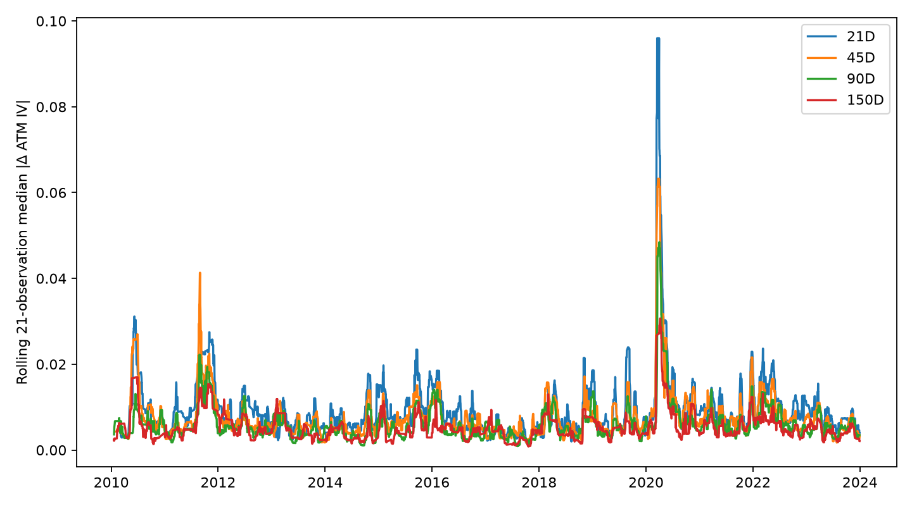
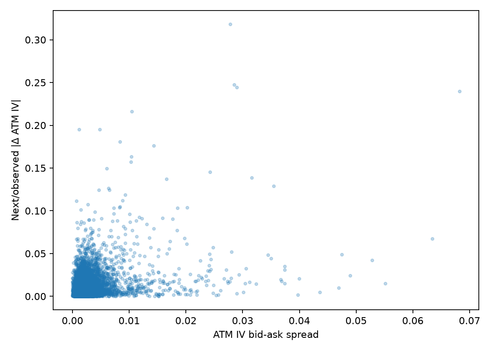
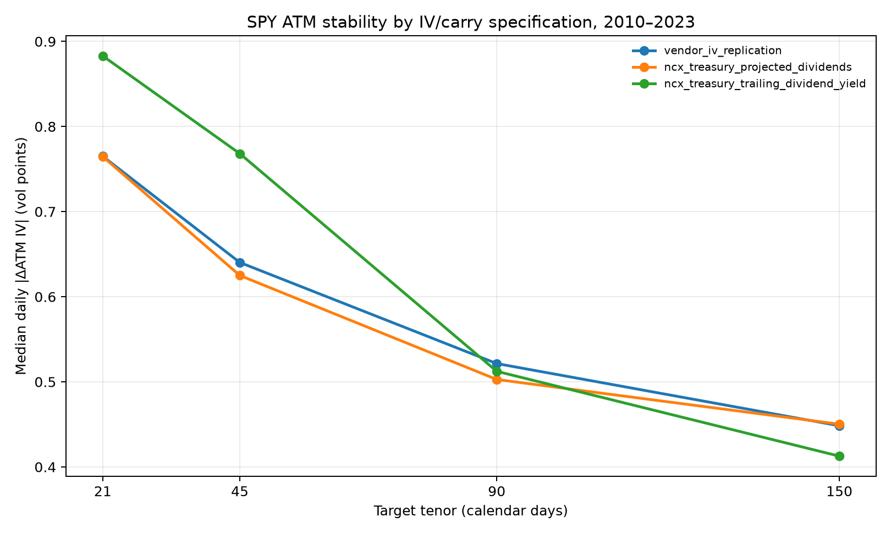

# How Stable Is SPY At-the-Money Implied Volatility Across Dates and Expiries, 2010–2023?

## Research 001A 完整报告

**研究对象：** SPDR S&P 500 ETF Trust（SPY）期权  
**样本期间：** 2010-01-04 至 2023-12-29  
**主要频率：** 每日 EOD snapshot  
**主要估计：** NCX bid/mid/ask IV inversion，Treasury curve + projected SPY distributions  
**主要期限：** nearest 21D、45D、90D、150D  
**报告状态：** Research 001A final；Research 001B 不在本报告范围内

---

## 摘要

本研究使用 2010–2023 年 SPY 日终期权链，考察 at-the-money implied volatility（ATM IV）在日期、期限、市场状态与 carry specification 之间的稳定性。正式主结果不把 vendor IV 当作真值，而是从原始 bid/ask 出发，以历史 Treasury constant-maturity yield proxy、SPY distribution schedule、NCX Stage 3.1 IV inversion 和 Stage 3.2 ATM interpolation 重建 bid/mid/ask ATM IV。Vendor IV replication 与 trailing-dividend-yield NCX reconstruction 被用作稳健性检验。

主结果显示，SPY ATM IV 的日度稳定性具有清楚且稳健的期限结构。Baseline 中，21D、45D、90D、150D 的 median daily \(|\Delta ATMIV|\) 分别为 0.765、0.625、0.503、0.450 vol points；21D 约为 150D 的 1.70 倍。相同排序——150D、90D、45D、21D，由最稳定到最不稳定——同时出现在 vendor IV、projected-dividend NCX 与 trailing-yield NCX 三套结果中。固定 expiry 的 DTE 分组也得到相同方向。因此，短期限更不稳定不是 vendor model 或单一 carry specification 制造的结果。

稳定性同时高度依赖市场状态。2020 年 21D median \(|\Delta ATMIV|\) 为 1.261 vol points，是 2017–2019 年的 2.32 倍；在预先冻结的 extreme-IV regime 中，21D median 变化为 2.802 vol points，是 low regime 的 5.06 倍。ATM bid–ask IV spread 与当日及次日 absolute change 均显著正相关，但只有约 13%–28% 的日变化落在前后两日平均 ATM IV spread 内，因此大多数观察到的变化不能只解释为静态 bid–ask uncertainty。

Carry 对结论的影响是“定性稳健、定量敏感”。Trailing-yield specification 没有改变期限排序，但在 45D 将 median instability 相对 baseline 提高 0.143 vol points（+22.9%），并明显提高 21D 结果。因此，期限效应主要是市场事实，但效应大小仍受历史分红处理影响。

**关键词：** SPY options；ATM implied volatility；volatility stability；term structure；bid–ask uncertainty；historical carry；total variance

---

## 1. 研究问题与贡献

Research 001A 回答以下问题：

1. SPY ATM IV 在相邻可比交易日通常变化多少？
2. 短期限 ATM IV 是否比长期限更不稳定？
3. 观察到的日变化有多少可能落在 bid–ask IV uncertainty 内？
4. 2020 年及高波动 regime 是否显著降低稳定性？
5. 更好的流动性是否对应更稳定的 ATM estimate？
6. ATM IV 与 ATM total variance 是否产生相同的稳定性排序？
7. Vendor IV、NCX baseline carry 与 alternative carry 是否得到相同结论？
8. Fixed-expiry 与 nearest-tenor 设计是否得到一致的期限方向？

本研究的主要贡献不是提出新的定价模型，而是建立一条可审计的真实数据链路：冻结原始数据和来源说明，显式构造历史 carry，从 bid/mid/ask 价格独立反演 IV，保留所有失败和样本损耗，并在相同 date-tenor 样本上比较 vendor 与 NCX specifications。

---

## 2. 数据与 provenance

### 2.1 SPY option chains

期权数据来自 Kaggle 分发的 **SPY Options EOD Data (2010–2023)**，uploader 为 `dudesurfin`，页面声称原始来源为 OptionsDX，并称 snapshot 约为美东时间 16:00。研究冻结 Kaggle version 2、14 个年度 Parquet 文件、页面 README、文件大小与 SHA-256。Kaggle 是分发渠道而不是交易所或原始 vendor；所有 provenance 表述均以冻结的 uploader 描述为依据。

原始样本包含：

| 项目 | 数值 |
|---|---:|
| 原始宽表行数 | 9,468,584 |
| Quote dates | 3,508 |
| Expirations | 1,572 |
| Unique strikes | 842 |
| 日期范围 | 2010-01-04–2023-12-29 |
| Weekend quote rows | 0 |
| Expiration before quote | 0 |
| Vendor DTE/date mismatch | 0 |

每个原始宽表行同时包含 call 和 put 字段；进入 NCX pipeline 前被展开为 contract-level 长表。

### 2.2 利率数据

Baseline 使用 FRED 的 DGS1MO、DGS3MO、DGS6MO、DGS1 和 DGS2 Treasury constant-maturity series。对每个 quote date：

1. 向前填补非交易日缺失，最大观察 staleness 为 3 天；
2. 将百分数转为小数；
3. 在 maturity 维度上线性插值，端点使用 flat extrapolation；
4. 将插值收益率作为 continuously compounded zero-rate proxy：

\[
D_r(t,T)=\exp[-r(t,T)T].
\]

这一做法覆盖 100% 的研究 expiry rows，但 Treasury yield 是 investment-basis government yield，不是期权实际 financing、repo 或 OIS zero curve。因此它是可复现 proxy，而不是无误差的无风险曲线。

辅助 rate specifications 包括 flat DGS3MO（100% carry coverage）和 flat SOFR。SOFR 从 2018-04-03 开始，在全样本 expiry panel 中覆盖 57.235%；它只被解释为 overnight-rate diagnostic，而不是 term OIS curve。

### 2.3 SPY distributions

SPY distribution history 来自 State Street 官方历史分配文件。2010–2023 期间共有 56 次 distributions。Baseline 保留实际历史 ex-date timing，但每个未来 payment amount 都使用 quote date 当时最后已知的 distribution amount，避免使用未来现金金额：

\[
D_q(t,T)=\frac{S_t-PV_t(\text{projected cash dividends to }T)}{S_t}.
\]

Alternative specification 使用过去 365 日现金分红除以 contemporaneous option-chain spot 得到 trailing dividend yield，并采用 flat dividend-yield curve。该设定平滑了季度 timing，适合检验短期限结果对 discrete dividend schedule 的敏感性。

需要注意，baseline 的 ex-date calendar 来自最终实现的历史日期；虽然未来金额没有泄漏，但 ex-date timing 并非由逐日 announcement archive 重建。这是一个仍需披露的历史回测限制。

### 2.4 Option-implied forward diagnostic

研究还使用 near-spot call/put midpoint 配对计算：

\[
F^{parity}_{t,T}=K+\frac{C_{mid}-P_{mid}}{D_r(t,T)}.
\]

该 diagnostic 覆盖 99.842% 的 carry expiries；相对 baseline forward 的 median absolute difference 为约 USD 0.158。由于 SPY listed options 为 American-style，early exercise、discrete dividends 和 quote noise 会污染简单 put–call parity，因此该 forward 只用于诊断，不进入正式 IV reconstruction。

---

## 3. 样本构造与 NCX 方法

### 3.1 基础范围

主样本限制为：

- 7 ≤ calendar DTE ≤ 180；
- finite positive spot 和 strike；
- \(|\log(K/S)|\le 0.40\)；
- 至少存在有效双边报价；
- 每个 smile 最低 5 个 selected research points；
- ATM 必须可观察或被左右 smile points bracket。

从 4,771,525 个范围内宽表 rows（9,543,050 个潜在 call/put contracts）出发，8 个交易日的全部 call/put bid/ask 都为空。这 8 日——2010-01-27 至 2010-02-05——被记录为 `NO_TWO_SIDED_QUOTES`，而不是静默删除。剩余日期中，9,536,134 个 contracts 进入 Stage 2，9,470,467 个通过 cleaning，8,356,199 个在要求的 IV source 上得到可用 inversion 结果。

### 3.2 IV inversion 与 ATM construction

每个 date-expiry 分别对 bid、midpoint 和 ask option price 运行 NCX Stage 3.1 IV inversion，再由 Stage 3.2 构造 ATM metrics。ATM 主要采用 total-variance 空间的线性插值：

\[
w(k,T)=\sigma^2(k,T)T,
\]

在 ATM 两侧 log-forward-moneyness points 之间求 \(k=0\) 的值。49,142 个 expiry records 中，49,103 个使用 `LINEAR_TOTAL_VARIANCE`，8 个为 exact `OBSERVED`，31 个没有正式 ATM method；midpoint 成功数为 49,110。

两个 NCX expiry panels 均无 duplicate expiry key，所有 risk-free 和 dividend discount factors 为正。Trailing-yield expiry panel 中出现 2 个 `bid IV > mid IV` 的 interpolation ordering exceptions，分别为 2014-06-19 的 14D expiry 和 2015-10-29 的 8D expiry。它们被保留并写入 validation artifact，没有事后强制修正；二者均未进入最终 nearest-tenor panel 的 ordering exceptions。

### 3.3 Nearest-tenor design

Target tenors 与最大 mismatch 为：

| Target | 容许范围 |
|---:|---:|
| 21D | ±7 days |
| 45D | ±10 days |
| 90D | ±15 days |
| 150D | ±25 days |

每天选择实际 DTE 最接近 target 的成功 expiry；tie 时使用确定性规则。结果保留 actual DTE、expiration 和 mismatch。最终形成 12,808 个 nearest-tenor observations。

### 3.4 稳定性变量

主要 outcome 为：

\[
\Delta ATMIV_{t,\tau}=ATMIV_{t,\tau}-ATMIV_{t-1,\tau},
\qquad
ATMInstability_{t,\tau}=|\Delta ATMIV_{t,\tau}|.
\]

只在同一 underlying、同一 target tenor、连续可比 observation 且两日 tenor mismatch 均合格时计算。其他变量包括：

\[
RelativeInstability=\left|\frac{\Delta ATMIV_t}{ATMIV_{t-1}}\right|,
\]

\[
ATMIVSpread=ATMIV^{ask}-ATMIV^{bid},
\]

\[
\Delta w_t=ATMIV_t^2T_t-ATMIV_{t-1}^2T_{t-1},
\]

以及 diagnostic：

\[
NoiseAdjustedMove=
\frac{|\Delta ATMIV_t|}
{\tfrac12(ATMIVSpread_t+ATMIVSpread_{t-1})}.
\]

Noise-adjusted move 不是统计显著性检验，只衡量变化相对报价区间的大小。

### 3.5 Market regimes

Calendar periods 预先定义为 2010–2012、2013–2016、2017–2019、2020、2021–2023。Volatility regimes 使用整个 nearest-tenor panel 的 ATM IV pooled distribution 冻结阈值：

- low：ATM IV ≤ 15.448%；
- medium：15.448%–20.814%；
- high：20.814%–27.341%；
- extreme：>27.341%。

这些是样本内部的 50th、80th 和 95th percentile thresholds，不是外部 VIX regime，也不应被解释为结构性市场断点。

### 3.6 回归

主回归为：

\[
|\Delta ATMIV_{t,\tau}|=
\alpha+\beta_1\log(DTE)+\beta_2ATMSpread_{t,\tau}
+\beta_3|Return_t|+\beta_4PastRV_t+\beta_5HighVol_t
+\gamma_\tau+\varepsilon_{t,\tau}.
\]

Quote uncertainty regression 将因变量换为下一观察日的 \(|\Delta ATMIV|\)。两者均使用 HAC/Newey–West standard errors，max lag 为 5。模型用于条件相关而不是因果识别。

---

## 4. 主要描述性结果

### 4.1 ATM level 与期限稳定性

| Target tenor | Observations | Coverage | Median ATM IV | Median ATM IV spread | Median \(|\Delta ATMIV|\) | P95 \(|\Delta ATMIV|\) | Median relative instability |
|---:|---:|---:|---:|---:|---:|---:|---:|
| 21D | 3,234 | 92.4% | 13.873% | 0.161 vol pts | 0.765 vol pts | 3.834 vol pts | 5.442% |
| 45D | 3,318 | 94.8% | 14.655% | 0.131 vol pts | 0.625 vol pts | 2.901 vol pts | 4.213% |
| 90D | 3,332 | 95.2% | 15.839% | 0.121 vol pts | 0.503 vol pts | 2.281 vol pts | 3.104% |
| 150D | 2,924 | 83.5% | 17.025% | 0.178 vol pts | 0.450 vol pts | 1.964 vol pts | 2.612% |

三个结论同时成立：

1. Absolute daily change 随期限延长而下降；
2. Relative instability 也随期限延长而下降；
3. P95 tail change 的期限差异比 median 更明显。

150D 的 median bid–ask IV spread 反而是四个 tenor 中最大，但其 daily instability 最低。因此，期限排序不能简单归因于长期限报价区间更窄。

### 4.2 Fixed-expiry evidence

不经过 nearest-tenor selection、直接追踪 fixed expiration 并按实际 DTE 分组，结果为：

| Actual DTE bin | Expiry observations | Median \(|\Delta ATMIV|\) | P95 \(|\Delta ATMIV|\) |
|---|---:|---:|---:|
| 7–30 | 22,049 | 0.858 vol pts | 4.312 vol pts |
| 31–60 | 11,637 | 0.641 vol pts | 3.114 vol pts |
| 61–120 | 8,922 | 0.503 vol pts | 2.235 vol pts |
| 121–180 | 6,502 | 0.443 vol pts | 1.942 vol pts |

Fixed-expiry 与 nearest-tenor 结果方向一致，说明期限效应不是 target-expiry rollover 选择单独造成的。但本研究尚未完成 Stage 3.3 constant-maturity interpolation，因此不能把 nearest-tenor、fixed-expiry 与真正 constant-maturity 三者做最终 horse race。

---

## 5. 市场状态与 2020 年

### 5.1 Calendar-period comparison

| Period | 21D | 45D | 90D | 150D |
|---|---:|---:|---:|---:|
| 2010–2012 | 0.912 | 0.650 | 0.526 | 0.492 |
| 2013–2016 | 0.740 | 0.596 | 0.428 | 0.408 |
| 2017–2019 | 0.543 | 0.503 | 0.446 | 0.395 |
| 2020 | 1.261 | 1.097 | 0.798 | 0.639 |
| 2021–2023 | 0.844 | 0.685 | 0.562 | 0.481 |

表中单位均为 median daily \(|\Delta ATMIV|\) 的 vol points。相对 2017–2019，2020 年的 instability 倍数为：

- 21D：2.32×；
- 45D：2.18×；
- 90D：1.79×；
- 150D：1.62×。

危机放大效应在短期限最强，但所有期限都恶化。

### 5.2 Volatility-regime comparison

| Regime | 21D | 45D | 90D | 150D |
|---|---:|---:|---:|---:|
| Low | 0.554 | 0.474 | 0.366 | 0.320 |
| Medium | 1.093 | 0.856 | 0.575 | 0.494 |
| High | 1.531 | 1.030 | 0.744 | 0.604 |
| Extreme | 2.802 | 2.173 | 1.601 | 1.427 |

从 low 到 extreme，21D median instability 上升 5.06 倍，150D 上升 4.47 倍。市场压力不是只影响 front end；整个 term structure 都变得更不稳定。

---

## 6. Quote uncertainty 与 observed moves

| Tenor | Median ATM IV spread | Median noise-adjusted move | Move within average spread | Spread vs next move Spearman |
|---:|---:|---:|---:|---:|
| 21D | 0.161 vol pts | 4.58× | 13.8% | 0.221 |
| 45D | 0.131 vol pts | 4.35× | 13.5% | 0.202 |
| 90D | 0.121 vol pts | 3.72× | 15.6% | 0.234 |
| 150D | 0.178 vol pts | 2.14× | 27.6% | 0.218 |

ATM quote uncertainty 是 measurement noise 的重要组成部分，但不能解释大多数 daily moves：在四个 tenor 中，只有约 13%–28% 的变化不超过前后两日平均 ATM IV spread。典型 absolute move 是平均 spread 的 2.1–4.6 倍。

HAC regression 进一步显示：

- 当日模型中 `atm_iv_spread` coefficient 为 0.482，p=0.00040；
- 次日模型中 `atm_iv_spread` coefficient 为 0.701，p=0.00023；
- 各 tenor 的 simple Spearman correlation 约为 0.20–0.23。

因此，更宽的 ATM IV quote interval 与更大的当日和次日 estimate change 有统计关联。不过，这可能同时反映低流动性、信息到达、市场压力和微观结构噪声；不能解释为 spread 对未来波动变化的因果作用。

---

## 7. Liquidity evidence

以 median relative option-price spread 在每个 tenor 内划分 quintiles 后，稳定性并不严格单调。例如 150D 从最窄-spread quintile 的 0.382 vol points 上升到最宽-spread quintile的 0.623 vol points；但 21D 和 45D 的中间 quintiles 并不按 spread 严格排序。这说明简单 liquidity portfolio 容易受到 volatility regime、ATM level 和日期 composition 影响。

在包含 underlying return、past realized volatility、high-vol regime 与 tenor fixed effects 的 HAC 模型中，ATM IV spread 仍为正且显著。综合来看：

- “较差报价质量与较高 instability 相关”得到支持；
- “所有 liquidity bins 都呈机械单调关系”不成立；
- liquidity 不能完全解释期限效应。

---

## 8. ATM IV 与 total variance

| Tenor | Median \(|\Delta ATMIV|\) | Median \(|\Delta w|\) | Median relative \(|\Delta w|/w_{t-1}\) |
|---:|---:|---:|---:|
| 21D | 0.765 vol pts | 0.000144 | 13.12% |
| 45D | 0.625 vol pts | 0.000271 | 10.55% |
| 90D | 0.503 vol pts | 0.000437 | 6.83% |
| 150D | 0.450 vol pts | 0.000675 | 5.61% |

结论依赖于 total variance 的尺度：

- Annualized ATM IV 的 absolute change 随 maturity 下降；
- Absolute total-variance change 因 \(T\) 的机械尺度而随 maturity 上升；
- Relative total-variance change 仍显示短期限更不稳定。

因此，“ATM IV 与 total variance 哪个更稳定”没有脱离尺度的单一答案。若比较 raw \(|\Delta w|\)，长 tenor 看起来变化更大；若比较相对变化，期限排序与 ATM IV 一致。这验证了研究预先提出的 H7：稳定性排序可能随 metric definition 改变。

---

## 9. 回归结果

### 9.1 Contemporaneous HAC model

样本数为 12,685，\(R^2=0.537\)。以 21D 为 reference tenor：

| Variable | Coefficient | HAC SE | p-value | 解释 |
|---|---:|---:|---:|---|
| 45D FE | -0.00264 | 0.00089 | 0.0031 | 比 21D 低约 0.264 vol pts |
| 90D FE | -0.00477 | 0.00177 | 0.0069 | 比 21D 低约 0.477 vol pts |
| 150D FE | -0.00657 | 0.00240 | 0.0061 | 比 21D 低约 0.657 vol pts |
| ATM IV spread | 0.482 | 0.136 | 0.00040 | 正向 quote-uncertainty relation |
| Absolute SPY return | 1.019 | 0.0617 | <10⁻⁶⁰ | 当日价格冲击是主要解释变量 |
| High/extreme regime | 0.00033 | 0.00065 | 0.614 | 加入 controls 后不显著 |
| Log DTE | 0.00018 | 0.00126 | 0.886 | 加入 discrete tenor FE 后不显著 |
| Past realized volatility | -0.00016 | 0.00297 | 0.958 | 条件上不显著 |

Tenor fixed effects 显著为负，支持短期限更不稳定。Absolute underlying return 是最强的 contemporaneous correlate。Descriptive regime differences 很大，但 high/extreme dummy 在控制当日 absolute return、spread 和 tenor 后不显著；因此报告不能把 regime table 直接解释为独立因果效应。

### 9.2 Next-observation quote uncertainty model

样本数为 12,683，\(R^2=0.204\)。ATM IV spread coefficient 为 0.701（p=0.00023），absolute underlying return coefficient 为 0.305（p<0.0001），past realized volatility coefficient 为 0.0233（p<10⁻¹⁴）。相对 21D，45D、90D 和 150D fixed effects 仍显著为负。

该模型支持“今天更不确定的 ATM quote 往往对应下一观察日更大的 ATM estimate change”，但其预测解释力有限且没有建立因果识别。

---

## 10. Vendor IV 与 carry sensitivity

三套结果在 12,808 个共同 date-tenor keys 上比较；12,712 个 observations 具有三套口径共同且相同的 previous date。99.992% 的共同 keys 选择同一 expiration。

### 10.1 Three-way paired stability

| Specification | 21D | 45D | 90D | 150D | 稳定性排序 |
|---|---:|---:|---:|---:|---|
| Vendor IV replication | 0.765 | 0.640 | 0.521 | 0.448 | 150, 90, 45, 21 |
| NCX Treasury + projected distributions | 0.765 | 0.625 | 0.503 | 0.450 | 150, 90, 45, 21 |
| NCX Treasury + trailing dividend yield | 0.883 | 0.768 | 0.512 | 0.413 | 150, 90, 45, 21 |

单位为 median daily \(|\Delta ATMIV|\) vol points。

Vendor 与 baseline 的 ATM IV level correlations 为 0.992–0.996；vendor median level 比 baseline 低约 0.295–0.463 vol points。Aggregate stability 非常接近，但 individual absolute-move correlations 仅为 0.746–0.926，说明 vendor 与 NCX 对某些单日变化并不一致。

Trailing-yield 与 baseline 的 level correlations 为 0.995–0.998。它没有改变期限排序，但改变了短中期限 magnitude：

- 21D median instability：+0.118 vol points，约 +15.5%；
- 45D：+0.143 vol points，约 +22.9%；
- 90D：+0.010 vol points，约 +1.9%；
- 150D：-0.038 vol points，约 -8.3%。

因此，**期限排序不是 carry artifact，但短中期限效应大小具有实质 carry sensitivity**。这是本研究比单纯 vendor-IV replication 更重要的结论。

---

## 11. 预注册假设评估

| 假设 | 结论 | 证据与限定 |
|---|---|---|
| H1：短期限 ATM IV 日变化更大 | **支持** | Nearest-tenor、fixed-expiry bins 和三套 IV/carry specifications 均同方向 |
| H2：ATM IV spread 越大，次日变化越大 | **支持相关性** | Spearman 约 0.20–0.23；HAC coefficient 0.701，p=0.00023；非因果 |
| H3：高波动 regime 中稳定性下降 | **描述性支持，条件证据较弱** | Extreme/low 差异巨大；但 high-regime dummy 在 contemporaneous controls 中不显著 |
| H7：ATM total variance 与 ATM IV 排序可能不同 | **支持** | Absolute \(|\Delta w|\) 反转；relative \(|\Delta w|/w\) 保留短期限不稳定排序 |
| H8：nearest-tenor 更适合日度分析 | **部分支持，未完成最终检验** | Fixed-expiry 与 nearest-tenor方向一致；constant-maturity Stage 3.3 尚未完成 |

H4–H6 涉及跨 underlying 比较，属于 Research 001B，不由本报告检验。

---

## 12. 稳健性结论

已完成的正式稳健性包括：

1. Vendor IV versus raw-price NCX IV；
2. Treasury projected-dividend baseline versus Treasury trailing-yield alternative；
3. Bid/mid/ask ATM 全部保留；
4. Nearest-tenor versus fixed-expiry DTE bins；
5. Absolute versus relative ATM IV changes；
6. ATM IV versus total variance；
7. Calendar-period versus pooled-IV-quantile regimes；
8. Quote uncertainty 的 descriptive 与 HAC regression evidence。

已构造但未完成全链 IV reconstruction 的 diagnostics：

- Flat DGS3MO + projected distributions；
- Flat SOFR + projected distributions（仅 2018-04-03 后）；
- Realized future dividend amounts（含 look-ahead，只能 diagnostic）；
- Option-implied forward。

尚未完成或不具备足够 observations 的项目：

- 真正 30D/60D/90D constant-maturity panel；
- observed ATM versus interpolated ATM 的有力比较——正式 baseline 仅 8 个 exact observed ATM；
- 更完整的 OIS/repo financing curve；
- 公告时点可验证的 historical forward-dividend forecast archive。

---

## 13. 数据质量与限制

1. **Kaggle provenance。** Kaggle 是分发平台；原始来源、snapshot 和字段含义主要依赖 uploader 描述。数据不能被描述为直接交易所数据。
2. **Vendor model opacity。** Vendor IV 与 Greeks 的利率、分红、exercise 和数值细节不完整，因此只作为 replication 与 disagreement benchmark。
3. **Treasury financing proxy。** Treasury CMT yield 不等于 SPY option financing/repo/OIS curve；直接作为 continuously compounded zero proxy 是显式近似。
4. **Dividend timing。** Baseline 不使用未来现金金额，但使用最终历史 ex-date calendar。Trailing-yield alternative 消除离散 timing，却引入平滑误差。
5. **American exercise。** SPY options 是 American-style。NCX inversion 与 simple parity diagnostics 可能受 early exercise 和 discrete dividends 影响。
6. **EOD synchronization。** Uploader 声称约 16:00 snapshot，但仍可能存在 underlying last、option quote 和 vendor analytics 的轻微不同步。
7. **Quote quality。** 原始数据含 33,460 个 crossed-market rows、11,727 个 missing bid rows、11,727 个 missing ask rows和 106,588 个 non-positive asks；pipeline 通过明确 cleaning/IV policies 处理，并保存 attrition。
8. **Eight missing-quote dates。** 2010-01-27 至 2010-02-05 完全没有可用双边 bid/ask，无法进行 NCX price inversion。
9. **ATM interpolation。** 大多数 ATM 是 total-variance interpolation 而不是 exact observed strike。两个 trailing-yield expiry observations 出现 bid/mid ordering exception。
10. **Regime endogeneity。** Regimes 由同一 ATM IV sample 的 pooled quantiles 定义，适合描述，不构成外生 stress indicator。
11. **Nearest-expiry rollover。** Target tenor 仍会切换 expiration。Fixed-expiry结果提供方向性检查，但 constant-maturity 尚未完成。
12. **Inference。** HAC regressions 处理有限 serial correlation，但不构成因果设计，也没有完全解决 generated-regressor、overlapping-tenor 或 multiple-testing 问题。
13. **External validity。** 本报告只研究 SPY，不能代表全部 ETF、个股或美国期权市场。

---

## 14. 可重复性

研究保存：

- 原始 Kaggle files、version、README snapshot、sizes 和 SHA-256；
- FRED 与 State Street 原始下载文件及 SHA-256；
- immutable research configuration 与 config SHA-256；
- expiry、tenor、return 和 carry Parquet panels；
- sample attrition、daily exclusions、audit failures 与 numerical validation；
- 每套 specification 的 run manifest、logical panel hashes 与 output hashes；
- deterministic daily checkpoints，可在不中断既有结果的情况下恢复运行。

完整非-large test suite 结果为 **458 passed，1 deselected**。被 deselect 的是项目默认标记的 large test；不是 Research 001 的失败测试。

主要可复现产物：

- `spy_2010_2023_ncx_baseline/atm_expiry_panel.parquet`
- `spy_2010_2023_ncx_baseline/atm_tenor_panel.parquet`
- `spy_2010_2023_ncx_trailing_dividend/atm_expiry_panel.parquet`
- `spy_2010_2023_ncx_trailing_dividend/atm_tenor_panel.parquet`
- `spy_2010_2023_carry_comparison/carry_specification_comparison.csv`
- `spy_2010_2023_carry_comparison/paired_carry_differences.csv`
- `historical_carry/carry_source_manifest.json`

---

## 15. 结论

SPY ATM implied volatility 不是一个跨期限、跨日期都均匀稳定的量。2010–2023 的证据表明：

1. 短期限 ATM IV 的 typical 和 tail daily changes 都显著大于长期限；
2. 期限排序在 fixed expiry、nearest tenor、vendor IV 和两套 NCX historical-carry specifications 下保持不变；
3. 市场压力会使整个 term structure 更不稳定，且 front end 放大最强；
4. Bid–ask IV uncertainty 与 observed instability 有关，但无法解释大多数 daily moves；
5. Liquidity effect 在简单分组中非单调，在条件回归中则表现为更宽 ATM spread 对应更大的变化；
6. Total variance 的结论依赖 absolute 或 relative normalization；
7. Carry specification 不改变“短端更不稳定”的事实，但会实质改变短中期限效应大小。

最准确的一句话结论是：

> **SPY ATM volatility is not uniformly stable: stability improves with maturity, deteriorates sharply in stressed markets, and remains qualitatively robust—but not quantitatively invariant—across vendor and historical-carry specifications.**

---

## References and source records

1. Frozen Kaggle provenance: `data/raw/kaggle/spy_options_2010_2023/dataset_manifest.json`.
2. Federal Reserve Economic Data, Treasury Constant Maturity Rate series: <https://fred.stlouisfed.org/data/DGS1MO>.
3. Federal Reserve Economic Data, Secured Overnight Financing Rate: <https://fred.stlouisfed.org/series/SOFR>.
4. State Street Global Advisors, ETF Dividend Distributions: <https://www.ssga.com/us/en/intermediary/resources/documents/etf-dividend-distributions>.
5. Historical carry methodology: `outputs/historical_carry/historical_carry_methodology.md`.
6. Baseline run manifest: `outputs/spy_2010_2023_ncx_baseline/run_manifest.json`.
7. Carry comparison manifest: `outputs/spy_2010_2023_carry_comparison/comparison_manifest.json`.
